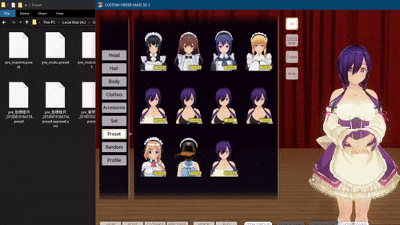
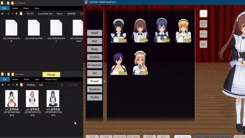
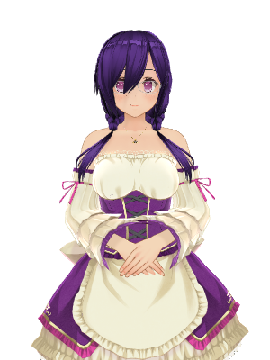

# COM3D2.PNGPreset

Save maid presets (and ExtPreset data) into PNG files!

## Features

* Saves maid presets into small (~200 kB) PNG images
* Can be used like normal presets
* Supports encoding ExtPreset data

## Installation

Download the latest [release](https://github.com/denikson/COM3D2.PNGPreset/releases).  
Extract the archive into `Sybaris` folder.

## How to use

To use PNGPreset, you must be in maid edit mode.

### Saving a preset

To save a preset, hold <kbd>Ctrl</kbd> and save it as you normally would:

The PNG preset will appear in the preset folder. If there is ExtPreset data, it will be included inside the PNG.

### Loading a preset

To load a preset, put it into `Preset` folder and load normally.

**Alternatively**, you can add presets by dragging and dropping them when you're in edit mode:

## Example preset

A PNG preset looks like a normal image:

Try loading this preset into your game!

## I want to uninstall this! How do I convert PNG presets to normal presets?

Sorry to hear that! In order to convert PNG presets to normal presets, use PNG2Preset tool included in [releases](https://github.com/denikson/COM3D2.PNGPreset/releases).

Simple drag and drop PNG files you want to convert and the tool will do the rest.